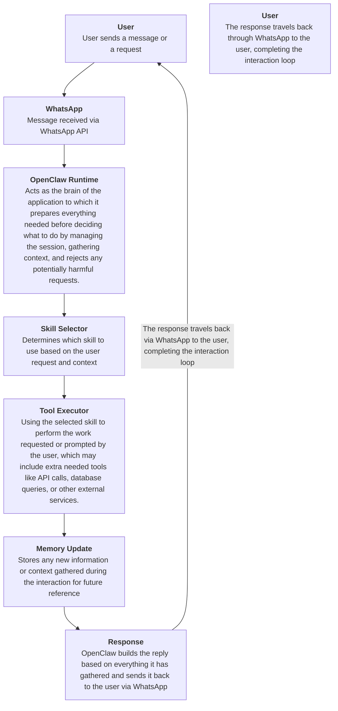

## OpenClaw Architecture Flow
How OpenClaw handles routing, session state, channel integration, and tool execution

```mermaid
graph TD
    1[<b>User</b><br>User sends a message or a request]
    2[<b>WhatsApp</b><br>Message received via WhatsApp API]
    3[<b>OpenClaw Runtime</b><br>Acts as the brain of the application to which it prepares everything needed before deciding what to do by managing the session, gathering context, and rejects any potentially harmful requests.]
    4[<b>Skill Selector</b><br>Determines which skill to use based on the user request and context]
    5[<b>Tool Executor</b><br>Using the selected skill to perform the work requested or prompted by the user, which may include extra needed tools like API calls, database queries, or other external services.]
    6[<b>Memory Update</b><br>Stores any new information or context gathered during the interaction for future reference]
    7[<b>Response</b><br>OpenClaw builds the reply based on everything it has gathered and sends it back to the user via WhatsApp]
    8[<b>User</b><br>The response travels back through WhatsApp to the user, completing the interaction loop]

    1 --> 2
    2 --> 3
    3 --> 4
    4 --> 5
    5 --> 6
    6 --> 7
    7 -->|The response travels back via WhatsApp to the user, completing the interaction loop| 1
```